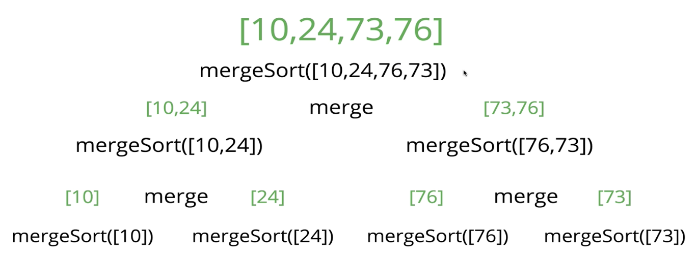

# 정렬(Sorting)

- 정렬은 프로그래밍에서 매우 흔하게 사용됨

## 📚 버블 정렬(Bubble Sort)


- 서로 인접한 두 요소를 반복적으로 비교하고 위치를 교환하는 알고리즘
- 두 요소를 비교하여 크기가 순서대로 있지 않으면 서로 교환

### 📌 구현

```javascript
function bubbleSort(arr) {
  for (var i = arr.length; i > 0; i--) {
    for (var j = 0; j < i - 1; j++) {
      console.log(arr, arr[j], arr[j + 1]);
      if (arr[j] > arr[j + 1]) {
        var temp = arr[j];
        arr[j] = arr[j + 1];
        arr[j + 1] = temp;
      }
    }
  }
  return arr;
}
```

최악의 시간 복잡도 : O(n^2)

### 💡 최적화

교환이 발생하지 않는다면 루프 종료

```javascript
const bubbleSort = (arr) => {
  let noSwaps;
  for (let i = arr.length; i > 0; i--) {
    noSwaps = true;
    for (let j = 0; j < i - 1; j++) {
      if (arr[j] > arr[j + 1]) {
        [arr[j], arr[j + 1]] = [arr[j + 1], arr[j]];
        noSwaps = false;
      }
    }
    // 교환이 일어나지 않았기 때문에 루프 종료
    if (noSwaps) break;
  }
  return arr;
};
```

최상의 시간 복잡도(대부분이 정렬되어 있다면) : O(n)

## 📚 선택 정렬(Selection Sort)


- 최솟값을 찾아 그 값을 맨 앞으로 위치 시키고, 그 과정을 반복

### 📌 구현

```javascript
function selectionSort(arr) {
  for (var i = 0; i < arr.length; i++) {
    // 최솟값은 인덱스[i]
    var lowest = i;
    // j는 i보다 1커야 비교가능
    for (var j = i + 1; j < arr.length; j++) {
      // j가 첫번째 인덱스보다 작다면 j가 lowest가 됨
      if (arr[j] < arr[lowest]) {
        lowest = j;
      }
    }
    // i가 최솟값이 아니라면 최솟값인 인덱스와 교체
    if (i !== lowest) {
      // 변수 temp에 arr[i] 저장
      var temp = arr[i];
      // 최솟값 = 진짜 최솟값
      arr[i] = arr[lowest];
      arr[lowest] = temp;
    }
  }
  return arr;
}

selectionSort([34, 22, 10, 19, 17]);
```

시간 복잡도 : O(n^2)

## 📚 삽입 정렬(Insertion Sort)


- 배열의 모든 요소를 앞에서부터 차례대로 비교하여 자신의 위치를 찾아 삽입하여 정렬하는 알고리즘
- 인덱스 1 부터 시작하여 왼쪽 요소들과 비교

### 📌 구현

```javascript
function insertionSort(arr) {
  for (let i = 1; i < arr.length; i++) {
    let currentVal = arr[i];
    // j가 i보다 작고, j는 0보다 크고, arr[j]가 currentVal보다 클때 j를 하나씩 뺀다.
    for (let j = i - 1; j >= 0 && arr[j] > currentVal; j--) {
      arr[j + 1] = arr[j];
    }
    arr[j + 1] = currentVal;
  }
  return arr;
}

insertionSort([2, 1, 9, 75, 4]);
```

최선의 시간 복잡도 = O(n)
최악의 시간 복잡도(배열이 역순일 경우) : O(n^2)

## 📚 정렬 알고리즘 Big O 비교


- 버블정렬, 선택정렬, 삽입 정렬은 작은 데이터 집합에서 효과적
- 버블정렬, 선택정렬은 거의 정렬되어 있는 배열을 정렬할 경우(Best case) 시간 복잡도는 O(n)
- 선택정렬은 배일이 정렬되어 있어도 최솟값을 찾기 위해 계속 반복해야 하므로 O(n^2)
- 삽입정렬은 데이터를 계속 정렬하고 추가해야 할 경우 효과적

## 📚 합병 정렬

- Divide and Conquer 알고리즘
- 배열을 작은 부분으로 나누고, 각 부분을 정렬한 다음 병합하여 전체를 정렬

### 📌 구현

1. 합병 정렬

```javascript
function merge(arr1, arr2) {
  let results = [];
  let i = 0;
  let j = 0;
  while (i < arr1.length && j < arr2.length) {
    if (arr2[j] > arr1[i]) {
      results.push(arr1[i]);
      i++;
    } else {
      results.push(arr2[j]);
      j++;
    }
  }
  while (i < arr1.length) {
    results.push(arr1[i]);
    i++;
  }
  while (j < arr2.length) {
    results.push(arr2[j]);
    j++;
  }
  return results;
}
merge([100, 200], [1, 2, 3, 5, 6]);
```

2. 재귀 합병 정렬

```javascript
function mergeSort(arr) {
  // 배열의 길이가 1이하일때 반환
  if (arr.length <= 1) return arr;
  // 배열의 절반
  let mid = Math.floor(arr.length / 2);
  // 중간지점을 기점으로 배열 자르기
  // 배열 길이가 1이하가 될때까지 재귀함수 호출
  let left = mergeSort(arr.slice(0, mid));
  let right = mergeSort(arr.slice(mid));
  // 합치기
  return merge(left, right);
}

mergeSort([10, 24, 76, 73]);
```

   

### 📌 합병 정렬의 Big O


- 시간 복잡도는 모두 O(n log n)
- 배열의 길이가 32 => 16 16 => 8 8 8 8 => 4 4 4 4 4 4 4 4 => ... 1이 될 때까지 나눈다면 32는 총 5번 분할됨 (n증가에 따르는 분할 수)
- 배열에서 n의 길이가 늘어나면 log n의 비율로 분할 횟수도 늘어남
- n의 길이가 늘어난다면, 합병 알고리즘 자체는 O(n)의 시간 복잡도를 가짐. 예를 들어 배열 요소가 8개가 있다면, 합병하는데 비교는 8번이 필요함


- 배열이 늘어나면 총 분할 수는 log n 비율로 늘어나지만, 합병을 할 때는 O(n)번의 비교를 함 => n \* log n
- 합병 정렬에서 공간 복잡도는 배열이 클수록 합병 정렬에서 더 많은 배열을 저장해야 함

## 📚 퀵 정렬(Quick Sort) (너무 어렵😭)


- 합병 정렬과 같은 가정으로 작동
- 분할 정복 알고리즘
- 하나의 리스트를 피벗을 기준으로 두 개의 비균등한 크기로 분할하고, 분할된 부분 리스트를 정렬한 다음, 두개의 정렬된 부분 리스트를 합하여 전체가 정렬된 리스트가 되게 하는 방법

### 📌 Pivot

- 배열을 분할하는데 사용되는 중심 요소
- 피벗에 해당하는 숫자보다 작은 숫자는 왼쪽으로 옮김

### 📌 Pivot helper function

퀵 정렬에서 피벗을 기준으로 두 개의 리스트로 나누는 과정(분할(Divide))

1. 왼쪽 포인터를 한 셀씩 계속 오른쪽으로 옮기면서 피벗보다 크거나 같은 값에 도달하면 멈춘다.
2. 이어서 오른쪽 포인터를 한 셀씩 계속 왼쪽으로 옮기면서 피벗보다 작거나 같은 값에 도달하면 멈춘다. 또는 배열 맨 앞에 도달해도 멈춘다.
3. 오른쪽 포인터가 멈춘 후 둘 중 하나를 선택해야 한다. 왼쪽 포인터가 오른쪽 포인터에 도달했으면(또는 넘어섰으면) 4단계로 넘어간다. 그렇지 않으면 왼쪽 포인터와 오른쪽 포인터가 가리키고 있는 값을 교환한 후 1,2,3단계를 반복한다.
4. 왼쪽 포인터가 현재 가리키고 있는 값과 피벗을 교환한다.

분할이 끝나면 피벗 왼쪽에 있는 값은 모두 피벗보다 작고, 피벗 오른쪽에 있는 값은 모두 피벗보다 크다. (아직 왼쪽과 오른쪽 값들은 정렬되지 않은 상태)

```javascript
function pivot(arr, start = 0, end = arr.length + 1) {
  // 두 요소 교환 함수
  function swap(array, i, j) {
    var temp = array[i];
    array[i] = array[j];
    array[j] = temp;
  }

  // 피벗 요소는 배열의 첫번째 요소
  // swapIdx는 시작 인덱스로 초기화
  var pivot = arr[start];
  var swapIdx = start;

  // 배열의 첫번째 요소부터 반복
  // 현재요소가 피벗(인덱스0)보다 작으면 swapIdx 증가
  // 현재요소(더 큰값)가 swapIdx의 위치와 교환
  for (var i = start + 1; i < arr.length; i++) {
    if (pivot > arr[i]) {
      swapIdx++;
      swap(arr, swapIdx, i);
    }
  }
  swap(arr, start, swapIdx);
  return swapIdx;
}

pivot([4, 8, 2, 1, 5, 7, 6, 3]);
// arr 출력 [3,2,1,4,5,7,6,8] 4가 퍼빗!
```

### 📌 퀵 정렬 구현

1. 배열을 분할한다. 피벗은 이제 올바른 위치에 있다.
2. 피벗의 왼쪽과 오른쪽에 있는 하위 배열을 다른 배열로 보고 재귀함수를 계속 반복한다. 하위 배열은 계속 분할하게 된다.
3. 하위 배열의 길이가 1이하이면 기저 조건이므로 아무것도 하지 않는다.

```javascript
function quickSort(arr, left = 0, right = arr.length - 1) {
  // 배열의 왼쪽은 오른쪽보다 작아야 함
  if (left < right) {
    // pivot 함수 호출
    let pivotIndex = pivot(arr, left, right); //3
    // 왼쪽, 오른쪽 배열에 대해 재귀함수 호출
    //left
    quickSort(arr, left, pivotIndex - 1);
    //right
    quickSort(arr, pivotIndex + 1, right);
  }
  return arr;
}

quickSort([100, -3, 2, 4, 6, 9, 1, 2, 5, 3, 23]);
```

### 📌 퀵 정렬의 Big O


- 최상의 경우와 평균 모두 O(n log n)
- 최악의 경우 O(n^2)

## 📚 기수 정렬(Radix Sort)

- 두 요소를 비교하지 않고 버킷을 사용해 정렬하는 방법
- 숫자 크기에 대한 정보를 자릿수로 인코딩

### 📌 기수 정렬 : helper 메소드

```javascript
// 1. 자리수에는 어떤 값이 있는가?
function getDigit(num, i) {
  // 7323 / 100 = 73.23
  // 73.23 % 10 = 3.23
  // Math.floor(3.23) = 3
  return Math.floor(Math.abs((num / Math.pow(10, i)) % 10));
}
getDigit(7323, 2); //3

// 2. 자리수는 몇 자리인가?
function digitCount(num) {
  if (num === 0) return 1;
  // Math.log10(423) ≈ 2.626
  // Math.floor(2.626) = 2
  // 2 + 1 = 3.
  return Math.floor(Math.log10(Math.abs(num))) + 1;
}
digitCount(423); //3

// 3. 최대 자리수 계산
function mostDigits(nums) {
  let maxDigits = 0;
  for (let i = 0; i < nums.length; i++) {
    maxDigits = Math.max(maxDigits, digitCount(num[i]));
  }
  return maxDigits;
}
mostDigits([23, 567, 89, 12242374, 7]);
```

### 📌 기수 정렬 : 구현

```javascript
function radixSort(nums) {
  let maxDigitCount = mostDigits(nums); //최대자리수:4
  // k = 현재 자릿수
  for (let k = 0; k < maxDigitCount; k++) {
    // 10개의 빈 배열로 이루어진 버킷 생성
    let digitBuckets = Array.from({ length: 10 }, () => []);
    for (let i = 0; i < nums.length; i++) {
      // nums[i] 숫자의 k번째 자릿수 찾음
      let digit = getDigit(nums[i], k);
      // 찾은 자릿수(digit)에 해당하는 digitBuckets의 버킷에 현재 숫자(nums[i])를 추가
      digitBuckets[digit].push(nums[i]);
    }
    // 모든 버킷을 결합하는 새로운 배열 생성
    nums = [].concat(...digitBuckets);
  }
  return nums;
}

radixSort([23, 345, 5467, 12, 2345, 9852]);
```

### 📌 기수 정렬의 Big O


- n은 정렬하려는 수의 갯수 즉 배열의 길이, k는 자릿수
